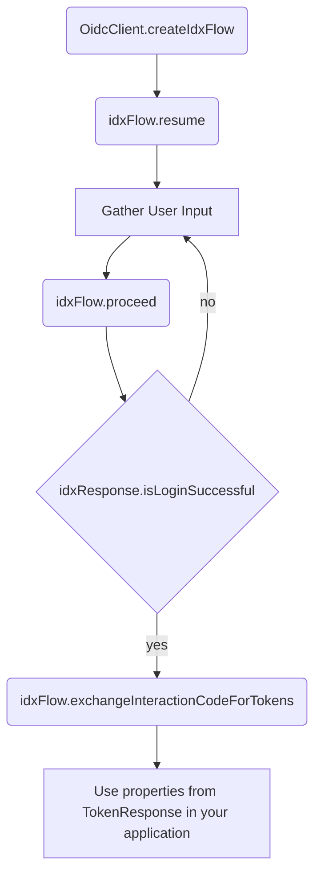

[](https://opensource.org/licenses/Apache-2.0)

# Okta IDX Android

This repository contains an SDK written in Kotlin for the Okta Identity Engine, as well as a sample Android application which can be used a reference for using
idx-kotlin on Android.

* [Introduction](#introduction)
* [Installation](#installation)
* [Need help?](#need-help)
* [IDX Kotlin SDK Documentation](#idx-kotlin-sdk-documentation)
* [Getting started](#installation--running-the-app)
* [Contributing](#contributing)

## Introduction
> :grey_exclamation: This SDK requires usage of the Okta Identity Engine.
This functionality is in [General Availability](https://developer.okta.com/docs/reference/releases-at-okta/#general-availability-ga) but is being gradually rolled out to customers. If you want to gain access to the Okta Identity Engine, please reach out to your account manager. If you
do not have an account manager, please reach out to oie@okta.com for more information.

## Installation

Add the `Okta IDX Kotlin` dependency to your `build.gradle` file:

```gradle
implementation 'com.okta.android:okta-idx-kotlin:2.0.0-BETA3'
```

See the [CHANGELOG](CHANGELOG.md) for the most recent changes.

## Need help?

If you run into problems using the SDK, you can

* Ask questions on the [Okta Developer Forums][devforum]
* Post [issues][github-issues] here on GitHub (for code errors)

## IDX Kotlin SDK Documentation

### idx-kotlin Overview

The idx-kotlin SDK embraces the dynamic [policies][dev-docs-policies] of Okta Identity Engine with the [interaction code flow][dev-docs-interaction-code-flow].
The SDK attempts to simplify the responses provided by the IDX endpoints, and provide a standard way of interaction with the IDX endpoints.
This is a high level flowchart of how the idx-kotlin SDK methods would be used by a calling application.



Gather User Input Notes:
- Use [IdxResponse](idx-kotlin/src/main/java/com/okta/idx/kotlin/dto/IdxResponse.kt) properties such as `remediations` and `authenticators` to continue satisfying remediations until the user is logged in
- Set `value` property in [IdxRemediation.Form.Field](idx-kotlin/src/main/java/com/okta/idx/kotlin/dto/IdxRemediation.kt)
- Set `selectedOption` property in [IdxRemediation.Form.Field](idx-kotlin/src/main/java/com/okta/idx/kotlin/dto/IdxRemediation.kt)

Notice the cyclical call-and-response pattern. A user is presented with a series of choices in how they can iteratively step through the authentication process, with each step giving way to additional choices until they can either successfully authenticate or receive actionable error messages.

Each step in the authentication process is represented by an `IdxResponse` object, which contains the choices they can take, represented by the `IdxRemediation` class. Remediations provide metadata about its type, a form object tree that describes the fields and values that should be presented to the user, and other related data that helps you, the developer, build a UI capable of prompting the user to take action.

When a remediation is selected and its inputs have been supplied by the user, the `IdxFlow.proceed` method can be called on the remediation to proceed to the next step of the authentication process. This returns another `IdxResponse` object, which causes the process to continue.

### IdxFlow

The `IdxFlow` class is used to define and initiate an authentication workflow utilizing the Okta Identity Engine.

This class makes heavy use of [Kotlin Coroutines][kotlin-coroutines] to perform the actions asynchronously.

#### OidcClient.createIdxFlow
The `createIdxFlow` extension method on `OidcClient` is used to create an `IdxFlow`, and to start an authorization flow.

#### IdxFlow.resume
The `resume` method on an `IdxFlow` is used to reveal the current remediations.

This method is usually performed after an `IdxFlow` is created, but can also be called at any time to reveal what remediations are available to the user.

#### IdxFlow.proceed
Executes the remediation option and proceeds through the workflow using the supplied form parameters.

This method is used to proceed through the authentication flow, using the data assigned to the nested fields' `value` and `selectedOption` to make selections.

#### IdxFlow.exchangeInteractionCodeForTokens
This method is used when `IdxResponse.isLoginSuccessful` is true, and there is an `IdxRemediation` having a type of `IdxRemediation.Type.ISSUE` in the `IdxRemediationCollection`.

Pass the `IdxRemediation` with type `IdxRemediation.Type.ISSUE` to exchange the interaction code in the remediation for ID, access, and refresh tokens (based on the scopes provided in the `IdxFlowConfiguration`).

#### IdxFlow.evaluateRedirectUri
This method evaluates the given redirect url to determine what next steps can be performed.
This is usually used when receiving a redirection from an IDP authentication flow.

## Contributing

We are happy to accept contributions and PRs! Please see the [contribution guide](CONTRIBUTING.md) to understand how to structure a contribution.

[devforum]: https://devforum.okta.com/
[github-issues]: https://github.com/okta/okta-idx-android/issues
[dev-docs-policies]: https://developer.okta.com/docs/concepts/policies/#how-policies-work
[dev-docs-interaction-code-flow]: https://developer.okta.com/docs/concepts/interaction-code/#the-interaction-code-flow
[kotlin-coroutines]: https://kotlinlang.org/docs/coroutines-basics.html
